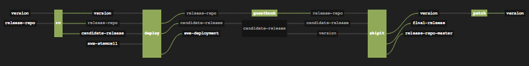

# kubernetes-release

Deploy [Kubernetes](http://kubernetes.io) easily with this
[BOSH](http://docs.cloudfoundry.org/bosh/) release.

## Kubernetes on your laptop

* Install [BOSH Lite](https://github.com/cloudfoundry/bosh-lite) and
  boot the Vagrant VM.
* Deploy Kubernetes:

```
$ bosh upload stemcell https://bosh.io/d/stemcells/bosh-warden-boshlite-ubuntu-trusty-go_agent?v=3262.2
$ git clone https://github.com/cloudcredo/kubernetes-release
$ cd kubernetes-release
$ bosh upload release releases/kubernetes/kubernetes-4.yml
$ ./generate_deployment_manifest warden $(bosh status --uuid) > manifest.yml
$ bosh deployment manifest.yml
$ bosh -n deploy
```

## Enabling DNS

The release includes an errand to deploy the DNS add-on to Kubernetes:

```
$ bosh run errand create-kubernetes-dns
```

## Running the Guestbook example

The release includes an errand to deploy the
[GuestBook example](https://github.com/GoogleCloudPlatform/kubernetes/tree/master/examples/guestbook).
```
$ bosh run errand guestbook-example
```

## Pipeline

The CI pipeline for this release is implemented using [Concourse](http://concourse.ci/).



Edit the provided `vars.yml` and then run the following commands against
your deployed Concourse:

```
$ fly -t k8s-ci login -c https://concourse.example.com
$ fly -t k8s-ci set-pipeline -p kubernetes -c pipeline.yml -l vars.yml
$ fly -t k8s-ci unpause-pipeline -p kubernetes
```

## Thanks

Thanks to [Brian Ketelsen](https://github.com/bketelsen/coreos-kubernetes-digitalocean)
and [CF Platform Engineering](https://github.com/cf-platform-eng/docker-boshrelease).
